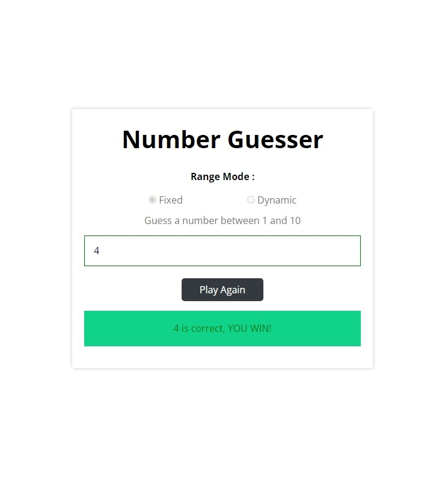

# Number-Guesser

Number guesser game with two options fixed or dynamic range and 3 tries of playing.

## Table of contents

- [Overview](#overview)
  - [The Number-Guesser features](#the-Number-Guesser-features)
  - [Screenshot](#screenshot)
  - [Links](#links)
- [My process](#my-process)
  - [Built with](#built-with)
  - [What I learned](#what-i-learned)
- [Author](#author)

## Overview

### The Number-Guesser features

Users should be able to:

- Select between two game options static and dynamic range with 3 tries of playing.
- Static range the user guesses a number between 1 and 10.
- Dynamic range the user sets the range by setting min and max numbers.
- Can guess until the 3 tries finish or you guess the correct number and win.
- Can play again and get a new 3 tries by clicking play again button.

### Screenshot

- Desktop view



### Links

- Live Site URL : [Number-Guesser](https://mahmoudsmohammed.github.io/Number-Guesser/)

## My process

### Built with

- HTML5
- CSS3
- SASS
- JavaScript

### What I learned

- How structure the project files.
- Using Git and Github.
- Use SASS and learn how to use Nesting which makes select elements much easier.
- Make event delegation to create a task on a specific child element.
- Functional programming by making each task at spread function to make code easy to debug and maintain.

```Js
function showMessage(msg, color) {
  guess.style.borderColor = color;
  result.style.display = 'block';
  result.textContent = msg;
  result.style.backgroundColor = color === 'green' ? '#10d389' : '#f8d7da';
  result.style.color = color;
}
function createRandom(min, max) {
  return Math.floor(Math.random() * (max - min + 1) + min);
}
```

## Author

- Linkedin - [Mahmoud Sayed](https://www.linkedin.com/in/mahmoud-sayed-b85536217/)
- Codewars - [@MahmoudsMohammed](https://www.codewars.com/users/MahmoudsMohammed)
